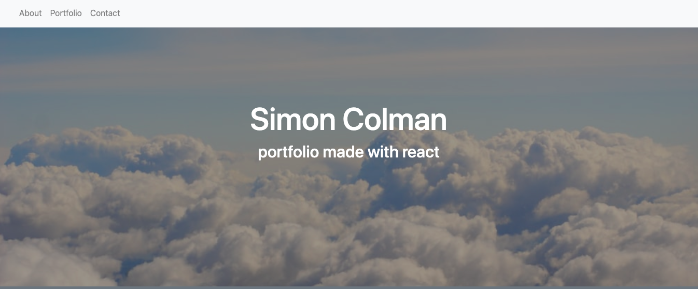
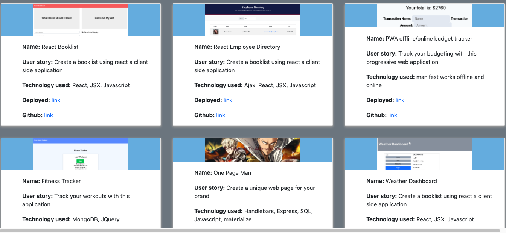
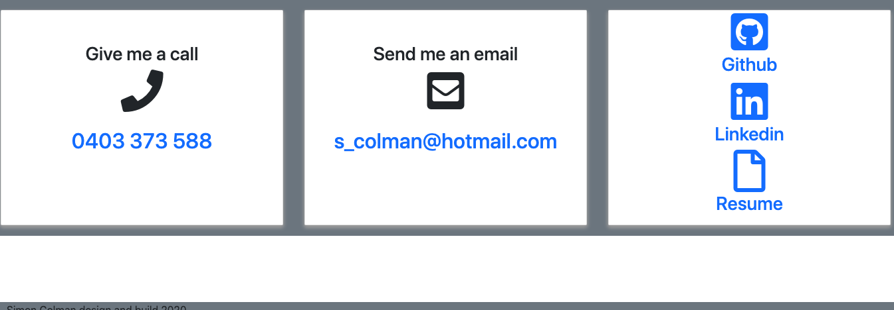

# React Portfolio

For local operation:

* npm install
* npm run build
* npm start

Deployed application:

(https://sijbc.github.io/react-portfolio/)

## React router

* The front end application is powered by react routine and each page displays a json object rendered as a component.

